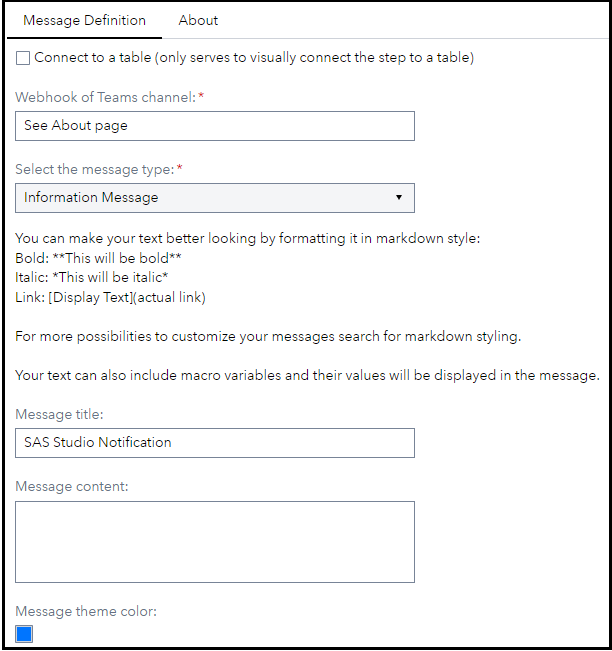
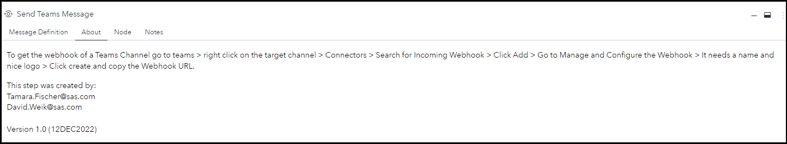
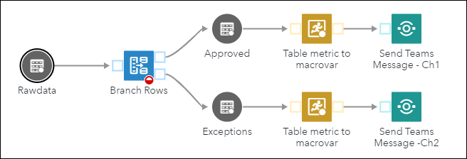

# Send Teams Message

## Description

The **Send Teams Message** custom step enables SAS Studio users to send Microsoft Teams Messages to a Teams channel.

## User Interface

- ### Message Definition tab

  

- ### About tab

  

## Requirements

2022.10 or later

You need to be able to create a Webhook for the target Teams channel or receive it from somebody that is allowed to create one (see About tab). If you have already created one but forgot the link, check the About tab to learn how to retrieve it.

## Usage

Find a demonstration of this step in this YouTube video: [Send Teams Message | SAS Custom Step](https://youtu.be/hCNPYjGUxFo).

The About tab includes a quick guide on how to retrieve the webhook of a channel.

Linking the flow to a table serves the purpose of visually representing a dependency on for example a macro variable that is passed into this step - the actual table data is not used inside of this step. Example:

What is happening in this flow?

1. Incoming data is checked and records that adhere to “rules” are rerouted to a central table, the other records are rerouted to an Exceptions table that requires further review.

2. Send message to general channel (**Channel #1**) that new data is available with some metrics (like #records, processing date, ….)

3. Send message to a special data owner/admin channel (**Channel #2**) that there’s data that needs to be reviewed before it can be processed further. 

## Change Log

- Version 1.0 (12DEC2022)
  - Initial version
