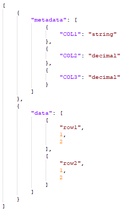
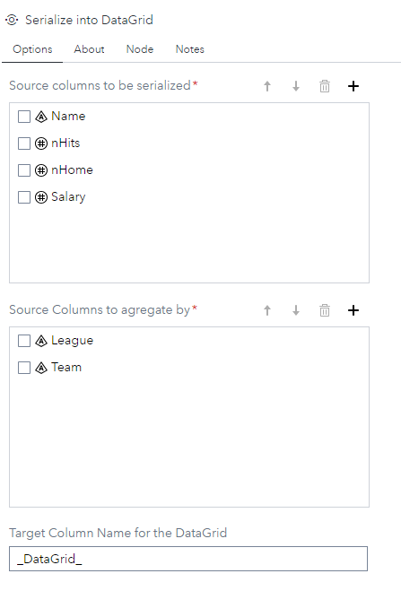
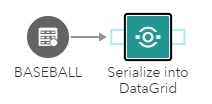

# Seliarize into DataGrid

## Description

This custom step allow the user serialize input data into a Json datagrid using DCM_SERIALIZEGRID macro function. 
The resulting Datagrid is formatted as below : 

<kbd></kbd>

## User Interface

### Options tab ###

   * From input, select columns to be serialized
   * From input, select columns to be agregated by
   * Chose a name for the output column containing the datagrid. 

   <kbd></kbd>

## Requirements

* Tested on Viya version Stable 2024.12

* Uses : DCM_SERIALIZEGRID macro (https://go.documentation.sas.com/doc/en/brscdc/3.3/brsdatagrids/n16ywg120fchftn1fxqdw245jax5.htm)

## Usage

   * To be used only in Flow mode. 

   <kbd></kbd>

   * Requires an input dataset with columns to be serialized and agregated by. 

   * DataGrid column is by default a length of 32767 bytes, which is the maximum. 
      * If a generated datagrid is longer than this length, truncation will occur. 
      * If a generated datagrid is truncated, an error message will be issued by the macro fonction, as well as a warning for each problematic row.
      * Note that the DCM_SERIALIZEGRID does not trim properly the character variables, this may lead to unexpected truncated datagrid if input columns length are big. 
	    Best practice is to reduce the max length of each column to be serialized. 
		
   * All remaining trailing blanks in serilized character columns into the datagrid are removed by a post process. 

   * Basic datagrid validation for unbalanced brackets is performed. The "valid_datagrid" flag contains the return code of this validation (1 = valied, 0 = invalid). 

## Change Log

* Version 1.0 (30DEC2024)
    * Initial version

