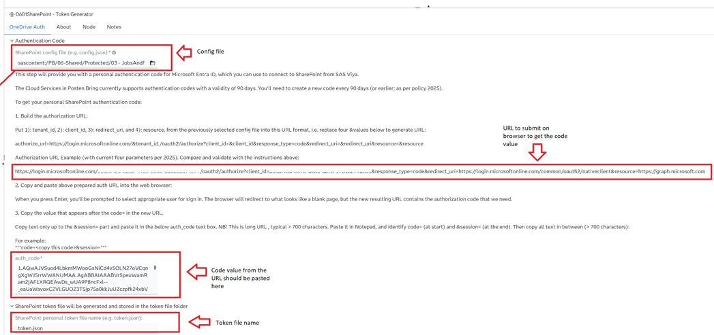
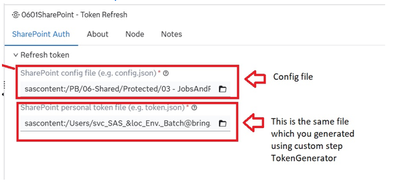
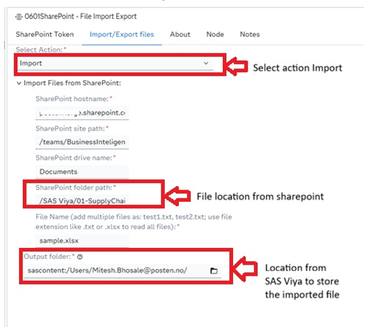
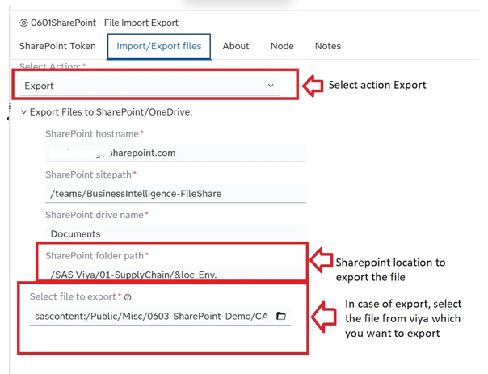

# SharePoint

## Description

The SharePoint Integration custom steps for SAS Viya provide a low-code interface for interacting with Microsoft 365, utilizing custom steps for authentication, file import, and file export. These tools, which support SAS Studio flow automation, streamline data workflows by directly connecting to SharePoint sites. For more details, visit 

The SharePoint Integration custom steps package provides a low-code/no-code interface within SAS Studio to seamlessly connect SAS Viya with Microsoft 365 SharePoint Online. By automating interaction with the Microsoft Graph API, these steps eliminate manual file downloads and uploads, ensuring error-free, automated data pipelines.

This folder contains a toolkit of three custom steps:

| Step | Purpose |
|---|---|
| **SharePoint - Token Generator** | Performs the one-time OAuth 2.0 authorization code flow to obtain an initial access token and refresh token from Microsoft 365. |
| **SharePoint - Token Refresh** | Exchanges a stored refresh token for a new access token, enabling automated session management without repeated manual authentication. |
| **SharePoint - File Import Export** | Uploads files from SAS Viya to a SharePoint document library, or downloads files from SharePoint into the SAS Viya file system. |

Together, these steps allow SAS Studio users to automate file-based integration with SharePoint and Microsoft 365 directly from a SAS pipeline flow.

## User Interface

> Screenshots for each custom step tab will be placed in the **img** folder once available.

### SharePoint - Token Generator step

#### Options tab

---

### SharePoint - Token Refresh step

#### Options tab

---

### SharePoint - File Import Export step

#### Options tab (Action: Import)

#### Options tab (Action: Export)

---

## Requirements

Tested on Viya version Stable 2026.04

## Usage

### Step 1 – Register your Azure App (one-time setup)
Before using any of these custom steps, register a new application in the [Azure Portal](https://portal.azure.com):
1. Navigate to **Azure Active Directory → App registrations → New registration**
2. Under **API permissions**, add the Microsoft Graph permissions listed in the Requirements section
3. Copy the **Client ID** and **Tenant ID** — these are needed in the config file for the custom steps
4. Config file (config.json) template:

    {
    "tenant_id": "your-tenant-id-here",
    "client_id": "your-client-id-here",
    "redirect_uri": "https://login.microsoftonline.com/common/oauth2/nativeclient",
    "resource": "https://graph.microsoft.com"
    }

### Step 2 – SharePoint - Token Generator (run once per project)
Use the **SharePoint - Token Generator** step to perform the initial OAuth 2.0 authorization code flow:
1. Provide your **Client ID**, **Tenant ID**, and **Redirect URI**
2. The step will generate an authorization URL — open this in a browser while signed in to Microsoft 365
3. After granting consent, copy the authorization code from the redirect URL
4. Paste the code back into the step to retrieve your **access token** and **refresh token**
5. Store the access token in a secure location (e.g., a private SAS Content folder under `/Users/your.account/My Folder/`)

> Token validity depends on your organization's security and governance policies. Typically, access tokens expire after approximately 1 hour. To maintain an active connection, you must execute the below Refresh Token step within this 1-hour window before the current token expires.

### Step 3 – SharePoint - Token Refresh (run multiple times)
Use the **SharePoint - Token Refresh** step:
1. Provide the path to your stored token
2. The step refresh access token generated in the previous step.

> [!TIP]
> **Automation Tip:** Schedule this step to run at regular intervals (e.g., every 45 minutes) to maintain a valid token and ensure uninterrupted integration.

### Step 4 – SharePoint - File Import Export
Use the **SharePoint - File Import Export** step to move files between SAS Viya and SharePoint:
- **Export (Upload):** Specify a local SAS Viya file path and a target SharePoint folder path — the step uploads the file using the Microsoft Graph API
- **Import (Download):** Specify a SharePoint file path and a local SAS Viya destination — the step downloads the file into your SAS session

### References

For detailed implementation steps, see this [SAS Communities Article](https://communities.sas.com/t5/SAS-Communities-Library/SAS-Viya-Integration-with-SharePoint-Microsoft-365-Using-Custom/ta-p/989042).

The code implemented within these custom steps is derived from, and inspired by, the following article:
> *Using SAS with Microsoft 365 (OneDrive, Teams, and SharePoint)*. SAS Users Blog, 2026.
> [https://blogs.sas.com/content/sasdummy/2026/02/02/sas-programming-office-365-onedrive/](https://blogs.sas.com/content/sasdummy/2026/02/02/sas-programming-office-365-onedrive/)

---

### Future Scope

* **Current State:** Three modular steps offer precise workflow control.
* **Capability:** Current verion fully supports complete, end-to-end automated workflows.
* **Future Roadmap:** Consolidation into a single **SharePoint: Connect & Transfer** step.

---

## Change Log
* **Version 1.0** (2026)
  * Initial release of the SharePoint custom step suite
  * Includes three steps: **SharePoint - Token Generator**, **SharePoint - Token Refresh**, and **SharePoint - File Import Export**
  * Supports OAuth 2.0 authorization code flow via Microsoft Graph API
  * Compatible with SharePoint Online and OneDrive 
