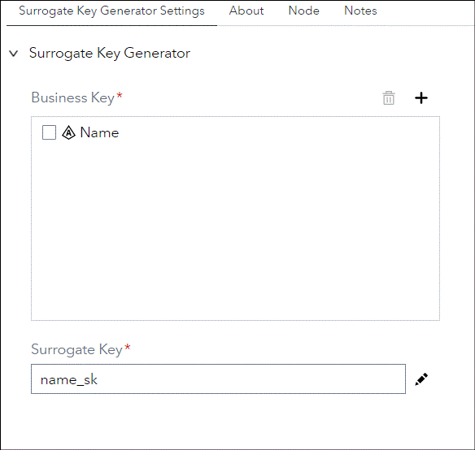
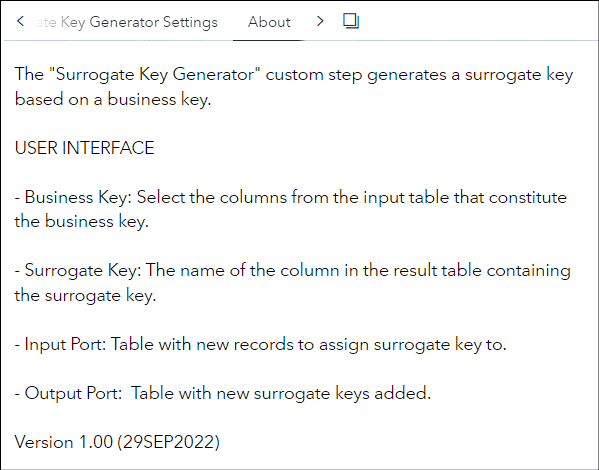

# Surrogate Key Generator

## Description

The "**Surrogate Key Generator**" custom step generates a surrogate key based on a business key.

## User Interface

* ### Surrogate Key Generator Settings tab ###
   

* ### About tab ###
   

## Usage

### Surrogate Key Generator Settings tab tab

- **Business Key:**
Select the columns from the input table that constitute the business key.
- **Surrogate Key:**
The name of the column in the result table containing the surrogate key.

### Input Port
- **Port 1:** Table with new records to assign surrogate key to.

### Output Port
- Table with new surrogate keys added.

## Change Log

* Version 1.0 (29SEP2022)
    * Inital version
