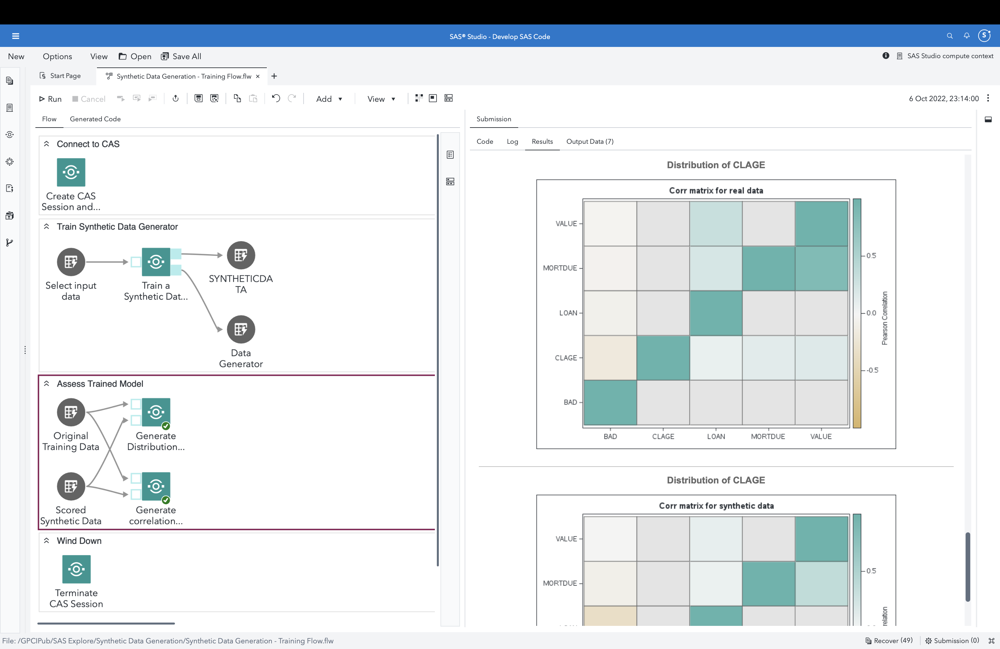
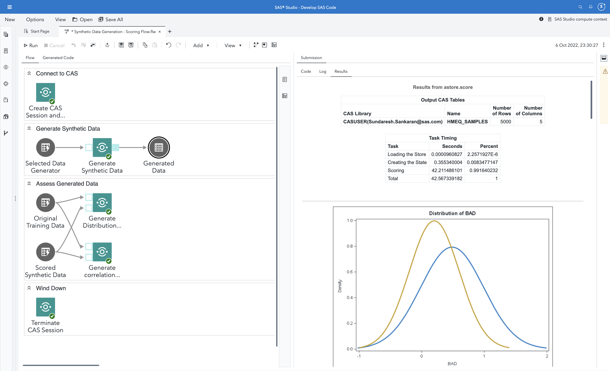
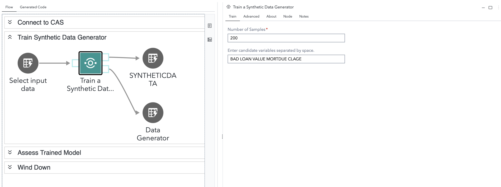
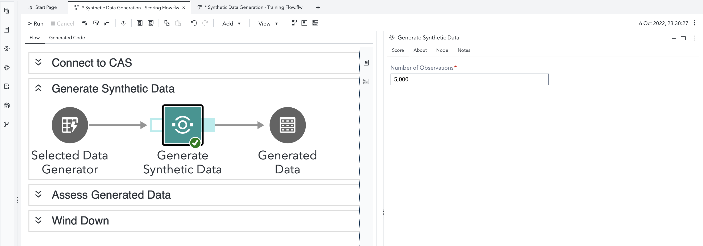
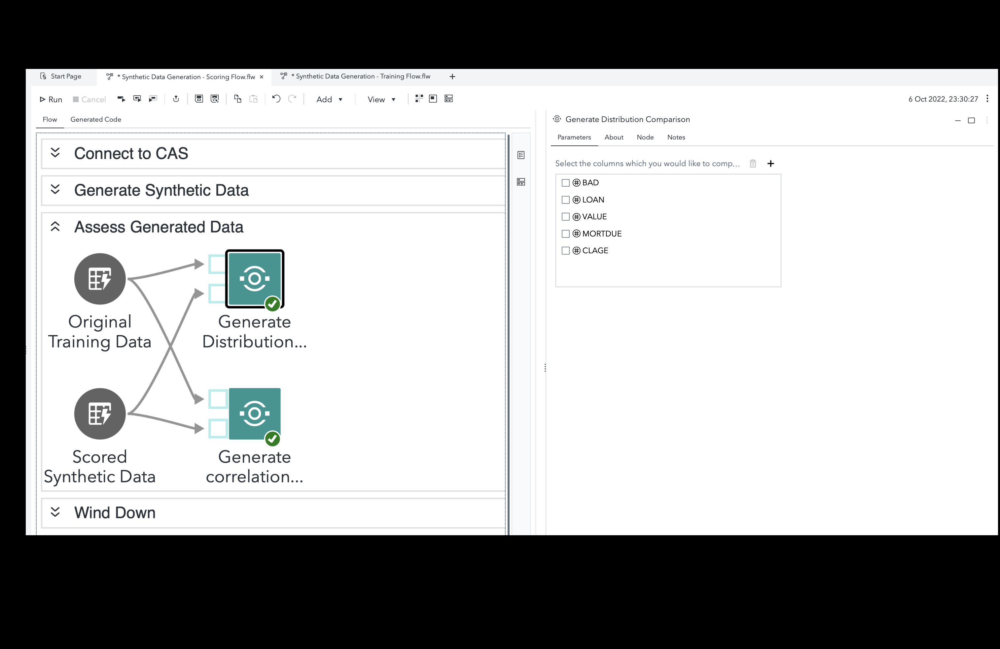
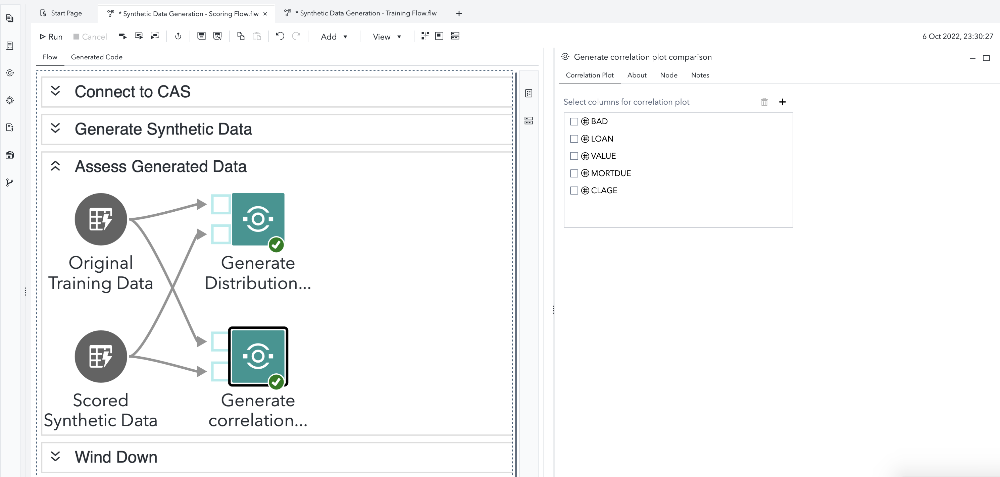

# Synthetic Data Generation

## Description
Make better data-informed decisions, even in situations where you have imbalanced, sparse, unobservable, or restricted data!  This folder contains **four** SAS Studio custom steps which help you train, score and assess Synthetic Data models.  

A general idea :

### Training a Synthetic Data Model

### Generating Synthetic Data

## SAS Viya Version Support
Tested in Viya 4, Stable 2022.09

## User Interface

Refer the "About" tab on each of the individual steps for more details on what they are used for.

### Train a Synthetic Data Generator
This step helps you train a synthetic data generator model, using a Generative Adversarial Network. Parameters required :
1. Variables you wish to generate a Synthetic Data Generator for
2. Number of sample observations, for assessment purposes
3. Optional - training parameters such as number of epochs etc. (Advanced)
4. Input port - attach a training dataset
5. Output ports - attach tables for the sample observations and the desired model binary (astore).

### Generate Synthetic Data
This step helps you generate new data using the trained astore. Parameters required:
1. Number of observations desired
2. Input Port - attach the astore referring the Generator you have trained
3. Output Port - attach a table referring the desired output table.

### Generate Distribution Comparison
This step helps you assess the distributions of your generated data with original data. Parameters required:
1. Select columns you wish to assess
2. Input Ports - attach the training (original) and the synthetic data tables

### Generate Correlation Comparison
This step helps you assess the correlation among variables in your generated and original data. Parameters required:
1. Select columns you wish to assess
2. Input Ports - attach the training (original) and the synthetic data tables

## Requirements

1. A SAS Viya 4 environment (monthly release 2022.09 or later) with SAS Studio Flows

## Installation & Usage

Refer to the [steps listed here](https://github.com/sassoftware/sas-studio-custom-steps#getting-started---making-a-custom-step-from-this-repository-available-in-sas-studio).

## Change Log

Version 1.0 (06OCT2022)

