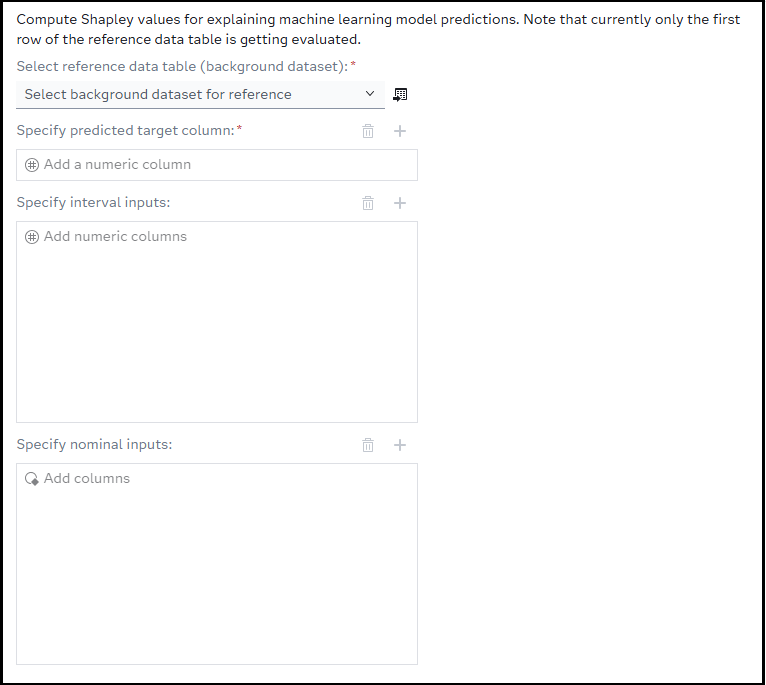
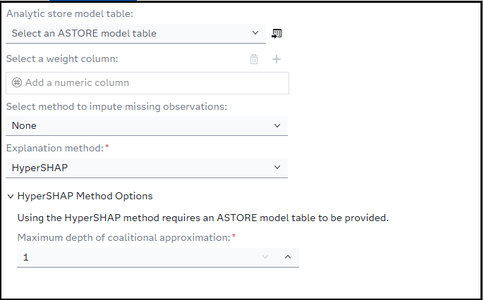

# Trustworthy AI (TAI) - Explain Predictions with Shapley

## Description
This custom step executes the Trustworthy AI procedure `PROC SHAPLEY` in SAS Viya to compute Shapley values, providing local explainability for machine learning model predictions. Shapley values help you understand how much each input variable contributes to an individual model prediction, helping build confidence, address auditing requirements, and explain model decisions to business stakeholders.

The step supports two calculation algorithms:
- **HyperSHAP**: A fast approximation method optimized for tree-based models.
- **KernelSHAP**: A model-agnostic, kernel-based approximation method for general models.

More information about PROC SHAPLEY: [PROC SHAPLEY documentation](https://go.documentation.sas.com/doc/en/pgmsascdc/default/casml/casml_shapley_toc.htm)

---
## Understanding Shapley Values
Shapley values are a method for determining how much individual factors contribute to a particular outcome. Rather than looking at each factor in isolation, Shapley values evaluate how the outcome changes when a factor is considered alongside different combinations of other factors. By averaging these contributions across many possible combinations, a Shapley value provides a fair and consistent measure of the influence of each factor on the final result.

Because this approach considers interactions between factors, it can provide a more complete view of contribution than simple importance measures. Shapley values are widely used to help explain complex decisions and outcomes by showing how each contributing factor increases, decreases, or otherwise influences a result. This makes them useful for education, transparency, auditing, and building trust in data-driven decision-making processes.

---
## Requirements
- **SAS Viya** environment (tested on stable release `2026.08`).
- **SAS Trustworthy AI** / **SAS Visual Data Mining and Machine Learning (VDMML)** license to access `PROC SHAPLEY`.

---
## Usage
Configure the input reference datasets, select your prediction column, select inputs, and define model hyperparameters in the **Design** and **Configuration** tabs. Run the step to generate the explainability results.

---
## User Interface

-   ### Design tab ###

    

-   ### Configuration tab

    

## Parameters

### Design Tab (Source Parameters)
- **Select reference data table (Background Dataset)** (Input Table, Required): A CAS table containing background observations used as a baseline for calculating Shapley values.
- **Specify predicted target column** (Column Selector, Required): The numeric column containing the model's predicted output value.
- **Specify interval inputs** (Column Selector, Optional): Select the numeric/interval input variables used by the predictive model.
- **Specify nominal inputs** (Column Selector, Optional): Select the nominal/categorical input variables used by the predictive model.

*(Note: While individual input lists are optional, you must specify at least one interval or nominal input variable for the step to execute.)*

### Configuration Tab
- **Analytic store model table** (Input Table, Optional): Select a saved Analytic Store (ASTORE) table representing your trained predictive model.
- **Select a weight column** (Column Selector, Optional): A numeric column specifying observation weights in the reference dataset.
- **Explanation Method** (Dropdown, Required): Select either **HyperSHAP** or **KernelSHAP**.

#### HyperSHAP Method Options
- **Maximum Depth of Coalitional Approximation** (Numeric Stepper, Required): Limits the coalitional approximation depth. (Allowed values: `1` to `2`, Default: `1`).

#### KernelSHAP Method Options
- **Bin Width for Interval Variables** (Numeric Stepper, Required): The bin width used to discretize continuous interval variables. (Default: `0.1`).
- **Include missing values in calculations** (Checkbox): If checked, missing values are treated as a distinct group rather than excluded.
- **Sample Size (Number of coalition samples)** (Numeric Stepper, Required): The number of coalition samples to generate for KernelSHAP. (Default: `500`).
- **Random Seed** (Numeric Stepper, Optional): Set a random seed value for reproducible KernelSHAP sampling.
- **Use raw data for calculation** (Checkbox): If checked, raw data values are used instead of binned approximations.

---
## Explanation Methods Supported

### HyperSHAP
An efficient, kernel-free approximation designed to compute Shapley values rapidly. This is highly recommended when working with tree-based models or when computing explanations across large datasets where performance is a primary concern.

### KernelSHAP
A model-agnostic method that uses a weighted linear regression (kernel) to estimate Shapley values. Because it does not assume specific model structures, it is suitable for any machine learning algorithm, though it requires more computational steps (controlled via the sample size parameter).

---
## ASTORE Requirements
When providing an **Analytic Store Model Table (ASTORE)** under the Configuration tab:
- The ASTORE table must exist in an active CAS library.
- The ASTORE model must correspond to the predictive model that generated the target predictions.
- `PROC SHAPLEY` uses this model definition to dynamically evaluate coalitions and generate accurate baseline contributions.

---
## Example Usage in a SAS Studio Flow

1. **Prepare Data**: Drag a SAS table node onto your canvas containing your validation or test dataset (acting as the reference dataset).
2. **Add Custom Step**: Place the **TAI - Explain Predictions with Shapley** step onto the canvas.
3. **Connect Nodes**: Connect your input dataset to the step.
4. **Configure Parameters**:
   - In the **Design** tab, choose your reference table and specify your predicted target column along with your input features.
   - In the **Configuration** tab, select your preferred method (e.g., `KernelSHAP`) and optionally connect an ASTORE model table.
5. **Run the Flow**: Execute the flow. Shapley values and variable importance calculations will be printed directly to the Results tab.

---
## Output Tables Generated
This step executes `PROC SHAPLEY` and outputs detailed explanation tables to the ODS (Output Delivery System) results window:
- **Shapley Values**: Displays the computed Shapley values for each selected input variable.
- **Model / Execution Summaries**: Outlines details regarding the selected method, execution times, and approximation parameters.

---
## Troubleshooting
- **Missing Required Parameters Error**: If you run the step and receive an error message in the log: `ERROR: Missing required parameters. Please check your SAS Studio Flow inputs and Target Variable selection.`, ensure that:
  - Both Reference Data and Predicted Target are mapped.
  - At least one Interval Input or Nominal Input variable is selected.
- **CAS Environment Errors**: Ensure your active session is connected to CAS. `PROC SHAPLEY` operates within memory in SAS Viya CAS environments and will fail on local-only datasets.

---
## Limitations and Notes
- **Single Instance Explanation**: The current macro implementation extracts a single observation (`obs=1` from the reference data) to act as the query instance (`_QUERY`) for explanation.
- **Target Type**: The predicted target column must be **numeric**.
- **Performance**: High sample sizes combined with numerous nominal/interval variables under `KernelSHAP` can dramatically increase runtimes. Adjust the sample size and bin width accordingly for complex models.

---
## Installation & Notes
This step is part of the `sas-studio-custom-steps` collection. Follow the repository instructions in the top-level README to make custom steps available in SAS Studio.

---
## Change Log

- Version 1.0.4 (06SEP2026)
  - Implement reviewer feedback

- Version 1.0.3 (28JUL2026)
  - Creation of `Understanding Shapley Values` section in README to explain what Shapley is

- Version 1.0.2 (27JUL2026)
  - SAS Code formatting changes (Properly Located Macro and Execution Code comments and Corrected Version Date)
  - Added version and contact info into step UI
  - README changed to that of the one generated by py_sas_studio_custom_steps.generate_readme()

- Version 1.0.1 (24JUL2026)
  - Renamed Step from "TAI - Shapley" to "TAI - Explain Predictions With Shapley"
  - Current tested version for SAS Viya 2026.05.
  - Supports HyperSHAP and KernelSHAP explanation methods.
  - Includes optional ASTORE model table support.
  - Includes optional weight variable support.
  - Reads the first observation from the selected reference data table into `CASUSER._QUERY` before running `PROC SHAPLEY`.

- Version 1.0.0 (06JUL2026)
  - Initial version
  - Proposed Design on what the step will contain and how it will be set up
