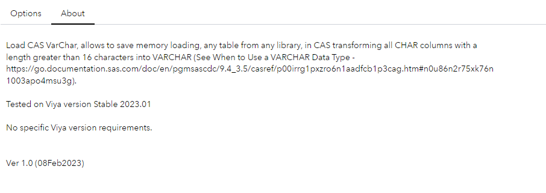

# UT – Load CAS with VarChar	 

## Description

Load CAS VarChar step, allows to save memory loading, any table from any library, in CAS transforming all CHAR columns into VARCHAR:
* Only CHAR variables with length >16 are changed to VARCHAR. 
* If requested the result table is compressed or promoted    
* If index columns have been provided the table is indexed.      
* If the output table exists is dropped        

Ver 1.0 (07Feb2023)

## User Interface

<mark>Note that this Custom Step is intended to output Cloud Analytics Services (CAS) tables. Ensure you have a connection to CAS established before running this step. References to output table names and locations below should be interpreted as referring to CAS Tables and caslibs. </mark>

* ### Options tab ###

   | Standalone mode | Flow mode |
   | --- | --- |                  
   |  |  |

Compress - No to not compress the table, Yes otherwise
Promote  - No to not promote the table, Yes otherwise
Index    - Provide the column(s) to create index (optional)

* ### About tab ###

   

## Requirements

Tested on Viya version Stable 2023.01, No specific Viya version requirements

## Usage

## Change Log

* Version 1.0 (08FEB2023)
    * Initial version

