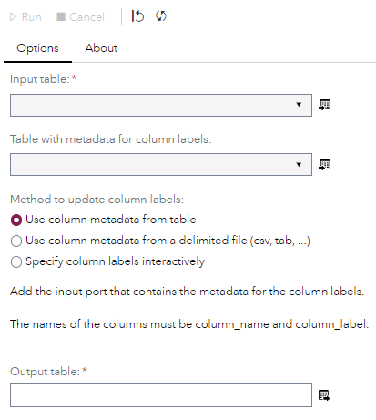
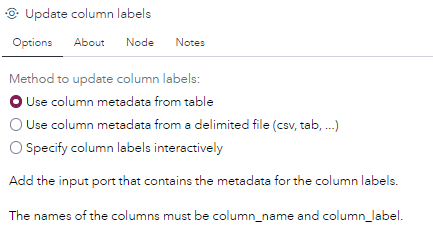
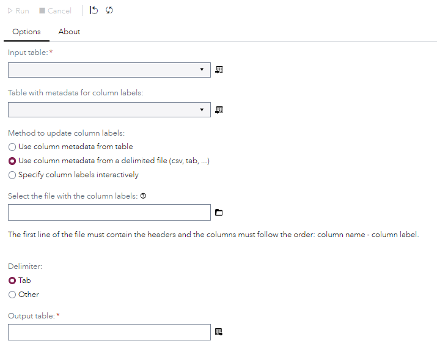
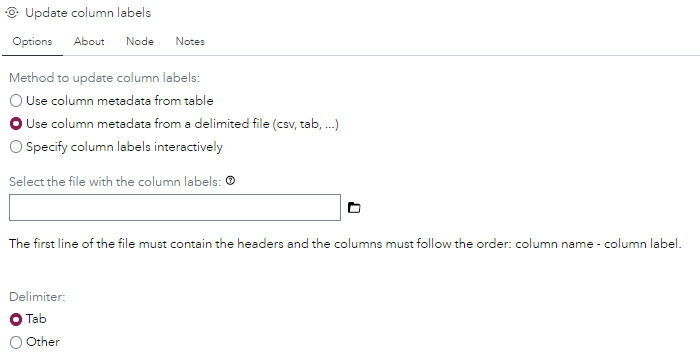
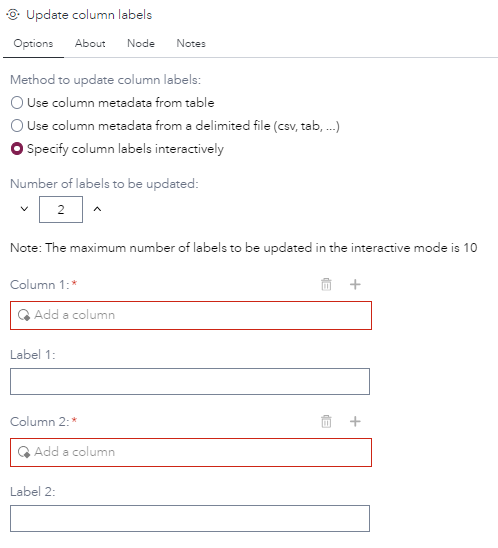
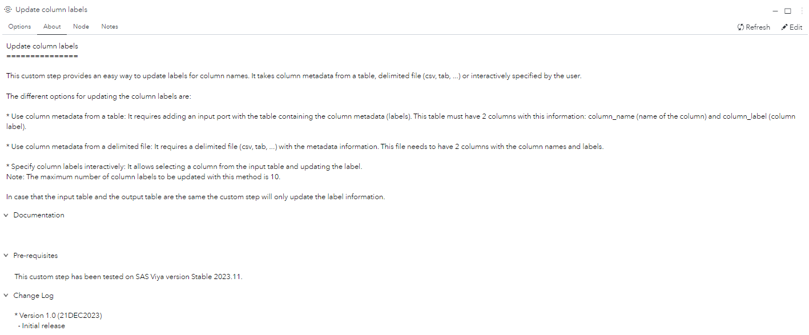
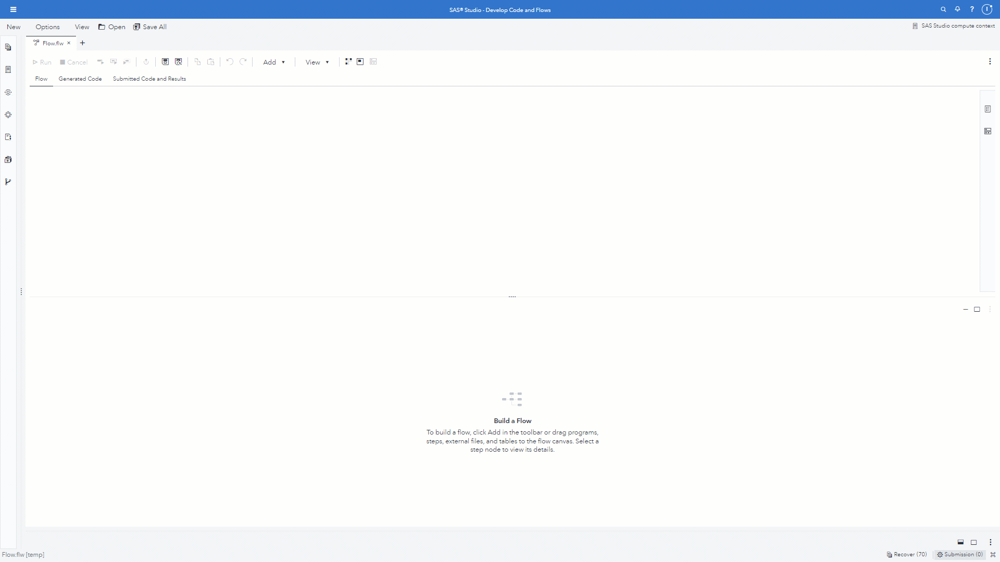

# Update column labels

## Description

The **Update column labels** custom step provides an easy way to update labels for column names. It takes column metadata from a table, delimited file (csv, tab, ...) or interactively specified by the user.

The different options for updating the column labels are:

- **Use column metadata from a table**: It requires adding an input port with the table containing the column metadata (labels). This table must have 2 columns with this information: column_name (name of the column) and column_label (column label).

- **Use column metadata from a delimited file**: It requires a delimited file (csv, tab, ...) with the metadata information. This file needs to have 2 columns with the column names and labels.

- **Specify column labels interactively**: It allows selecting a column from the input table and updating the label. 
Note: The maximum number of column labels to be updated with this method is 10.

In case that the input table and the output table are the same the custom step will only update the label information.

## User Interface

* ### Options tab (Use column metadata from table) ###

   | Standalone mode | Flow mode |
   |-----------| --- |                
   |  |  |

* ### Options tab (Use column metadata from delimited file) ###

   | Standalone mode | Flow mode |
   |-----------| --- |                
   |  |  |

* ### Options tab (Specify column labels interactively) ###

   | Standalone mode | Flow mode |
   |-----------| --- |                
   |  |  |

* ### About tab ###

   

## Requirements

This custom step has been tested on SAS Viya version Stable 2023.11.

## Usage

## Change Log

* Version 1.0 (21DEC2023) 
    * Initial version