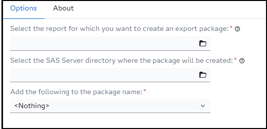
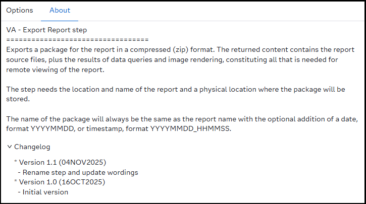

# VA - Export Report

## Description
Exports a package for the report in a compressed (zip) format. The returned content contains the report source files, plus the results of data queries and image rendering, constituting all that is needed for remote viewing of the report.

The step needs the location and name of the report and a physical location where the package will be stored.

The name of the package will always be the same as the report name with the optional addition of a date, format YYYYMMDD, or timestamp, format YYYYMMDD_HHMMSS.

## SAS Viya version support

This custom step is created and tested in Viya 4, Stable 2025.08

## User interface

### Tab: Options

- **Select the report for which you want to create an export package:**: Here you select the report for which you want to create the report package.
- **Select the SAS compute file directory where the package will be created:** Here you need to select a physical directory where the report package will be stored.
- **Add the following to the package name:** Here you have three choices:

| # | option | desciption | example result|
|---|--------|------------|---------------|
| 1 | &lt;Nothing>| This will add nothing to the resulting package name. Not that the default package name is the same as the name of the report. **This is the default value** | report_name.zip |
| 2 | Date | This will add the current date in format YYYYMMD to the package name. | report_name_20251029.zip |
| 3 | Timestamp | This will add the current date and time in format YYYYMMDD_HHMMSS to the package name. | report_name_20251029_150530.zip |

### Tab: About

## Usage

Download the .step file, upload it into your environment and start using it by selecting a SAS Visual Analytics report, a physical location to store the package and run your flow or step.

## Custom step messages
| Step message | Reason | Result |
|--------------|--------|--------|
| ERROR: Please select a location on the SAS Server. SAS Content folders are not supported by this custom step | The custom step only supports physical locations on the SAS compute environment | No package has been created.|
| NOTE: Report package for "&reportName" successfully created.| A note in the log specifying that the report package has been created successfully.| A report package with name of the report, optionally, the date or datetime added to it saved in the specified physical location.
| ERROR: Report package creation for "&reportName" failed. | The package creation failed. You will see the HTTP return code and the error description in the log file. | No package has been created.| 

## Change log
 - Version 1.1 (04NOV2025)
   - Rename step and update wordings
 - Version 1.0 (16OCT2025)
   - Initial version
