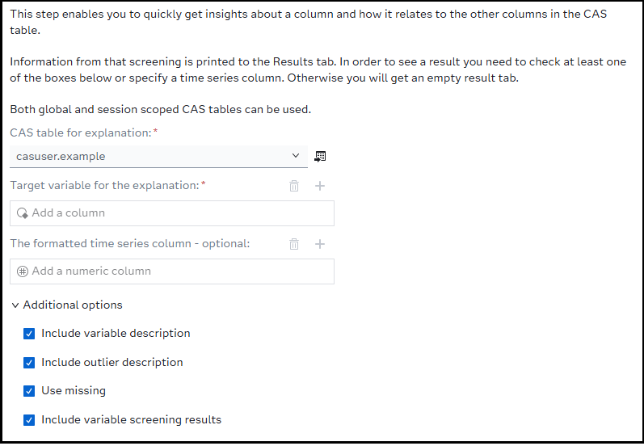

# VA - Get Column Explanation

## Description

The **VA - Get Column Explanation** custom steps performs an explanation of a column in a CAS table using the /insights/explain endpoint that is provided by SAS Visual Analytics.

## User Interface

* ### Options tab ###

   

## Requirements

Tested on Viya version Stable 2025.08

## Usage

Find a demonstration of this step in this YouTube video: [VA - Get Column Explanation](https://youtu.be/ICeu-6fFt5k).

## Change Log

* Version: 1.1 (25SEP2025)
  -   Move filename to be temporary
  -   Move additional options to a section
  -   Update the About page and README

* Version 1.0 (13SEP2025)
    * Initial version
