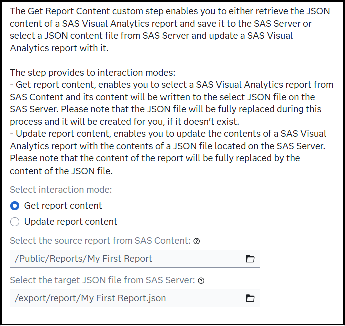

# VA - Get Report Content

## Description

The **VA - Get Report Content** custom steps provides the ability to either retrieve the content of a SAS Visual Analytics report and store it in a JSON file on the SAS Server for Git versioning or it can be used to updated a SAS Visual Analytics report with the contents of a JSON file stored on the SAS Server.

## User Interface

* ### Options tab ###

   

## Requirements

2025.07 or later

## Usage

Find a demonstration of this step in this YouTube video: [VA - Get Report Content](https://youtu.be/BBdtdxpZGR0)

## Change Log

* Version 1.0 (23AUG2025)
    * Initial version
