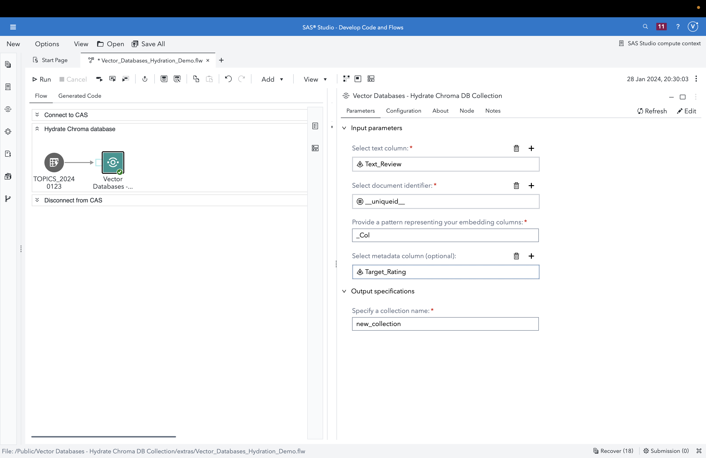

# Vector Databases - Hydrate Chroma DB Collection

This custom step populates a Chroma vector database collection with documents and embeddings contained in a SAS Cloud Analytics Services (CAS) table.

Vector databases facilitate many Generative AI applications, particularly in providing context to a Large Language Model (LLM).  Examples of other applications include recommendation engines, similarity search and time series forecasting. 

[Chroma](https://www.trychroma.com/#) is an open-source vector database used in Generative AI pipelines.  It shares many similar constructs and concepts with other vector store offerings. 

## User Interface

Here's a quick overview video (click on the image below):

[](https://www.youtube.com/watch?v=mX5IxT_JRHc)

----
## Table of Contents
1. [Assumptions](#assumptions)
2. [Requirements](#requirements)
3. [Parameters](#parameters)
   1. [Input Parameters](#input-parameters)
   2. [Configuration](#configuration)
   3. [Output Specifications](#output-specifications)
4. [Run-time Control](#run-time-control)
5. [Documentation](#documentation)
6. [SAS Program](#sas-program)
7. [Installation and Usage](#installation--usage)
8. [Created/Contact](#createdcontact)
9. [Change Log](#change-log)
----
## Assumptions

1.  For this initial version, your input data requires a text variable, a set of document embeddings (columns) and optionally, an additional categorical variable for metadata.  We plan to accommodate additional variables in future versions.

2.  Chroma DB follows client / server architecture.  This step implicitly considers the client and server to be on the same machine (see comments in code).  Users are free to modify the step for persistent, remote/external, or alternatively orchestrated (e.g. Docker container) servers based on their requirement.  Chroma DB documentation provides some examples (refer [Documentation](#documentation)).

3. While embeddings are typically created using either [SAS Visual Text Analytics](https://support.sas.com/en/software/visual-text-analytics-support.html) (VTA) or [Visual Data Mining and Machine Learning](https://www.sas.com/en_us/software/visual-data-mining-machine-learning.html) (VDMML), this custom step does not strictly require a VTA/VDMML license since it only makes use of the output from those applications.  

4.  This custom step runs on data loaded to a SAS Cloud Analytics Services (CAS) library (known as a caslib). Ensure you are connected to CAS before running this step. 

5. [Proc Python](https://communities.sas.com/t5/SAS-Communities-Library/Using-PROC-PYTHON-to-augment-your-SAS-programs/ta-p/812397) is required.  Details on Python packages in prerequisites section below.  Also, consider build and install of  Python and required packages through the SAS Configurator for Open Source.

6. Many vector databases (Chroma included), can auto-generate embeddings on ingested text data (documents), using either proprietary or open-source embedding models.  This custom step highlights the integration of SAS Viya-generated embeddings (from VTA / VDMML) with vector databases and therefore requires embeddings to be provided as part of input data.  A future version will examine how to auto-generate embeddings through the step. 

-----

## Requirements

1. A SAS Viya 4 environment version 2023.12 or later.

2. Python packages to be installed:

   1. [chromadb](https://pypi.org/project/chromadb/)
   2. [pysqlite-binary](https://pypi.org/project/pysqlite-binary/)
   3. [pandas](https://pypi.org/project/pandas/)
   4. [swat](https://pypi.org/project/swat/)
   5. [transformers(optional) ](https://pypi.org/project/transformers/)

3. Suggested Python version is [3.10.x](https://www.python.org/downloads/release/python-3100/) due to dependency on [sqlite version >= 3.35.0](https://docs.trychroma.com/troubleshooting#sqlite) (refer documentation).  However, a workaround suggested by Chroma has been followed in the code.

4. Optional components, based on site-specific architecture, are to have a separate Chroma DB server for persistence and scale.  Refer [Chroma documentation](https://docs.trychroma.com/usage-guide) for details.


----
## Parameters
----
### Input Parameters

1. Input table containing a text column (input port, required): attach a CAS table to this port.

2. Text column (column selector, required, maximum 1): select a text column which your embeddings represent.

3.  Document identifier (column selector, required, maximum 1): select a column which serves as a unique identifier for your observation.

4. Embedding pattern (text column, required):  document embeddings tend to be long series involving 100s or sometimes 1000s of columns.  To avoid having to select them individually, provide a text pattern which applies to all embedding column names. For example,  Col_ represents Col_1, Col_2..... Col_n.

5. Metadata column (optional, column selector, maximum 1): select a column which contains additional metadata (for example, a category, sentiment or star rating) which is also ingested into the vector database collection.

----
### Configuration 

1. Location for Chroma database (folder selector, required): select a location to persist the Chroma database.  Note this needs to be on the filesystem (SAS Server) and not SAS Content.  In case no value is provided, the path defaults to /tmp.  Note that /tmp gets cleared upon termination of the SAS compute session. 

2. CAS server (text field, default entered): change this only if you need a CAS server name different from a typical Viya 4 installation.

3. CAS port (numeric field, default entered): change this only if you know that the CAS server runs on a different port than the default.

----
### Output Specifications

- Name of collection (text column, required): provide a name for your collection.  A vector database collection can be viewed as similar to a table in a relational database.

Upon successful completion, an informational message is written to the log indicating number of records loaded.

----
## Run-time Control

Note: Run-time control is optional.  You may choose whether to execute the main code of this step or not, based on upstream conditions set by earlier SAS programs.  This includes nodes run prior to this custom step earlier in a SAS Studio Flow, or a previous program in the same session.

Refer this blog (https://communities.sas.com/t5/SAS-Communities-Library/Switch-on-switch-off-run-time-control-of-SAS-Studio-Custom-Steps/ta-p/885526) for more details on the concept.

The following macro variable,
```sas
_hcdc_run_trigger
```

will initialize with a value of 1 by default, indicating an "enabled" status and allowing the custom step to run.

If you wish to control execution of this custom step, include code in an upstream SAS program to set this variable to 0.  This "disables" execution of the custom step.

To "disable" this step, run the following code upstream:

```sas
%global _hcdc_run_trigger;
%let _hcdc_run_trigger =0;
```

To "enable" this step again, run the following (it's assumed that this has already been set as a global variable):

```sas
%let _hcdc_run_trigger =1;
```


IMPORTANT: Be aware that disabling this step means that none of its main execution code will run, and any  downstream code which was dependent on this code may fail.  Change this setting only if it aligns with the objective of your SAS Studio program.

----
## Documentation

1. Documentation for the [chromadb Python package and Chroma DB](https://docs.trychroma.com)

2. An [important note regarding sqlite](https://docs.trychroma.com/troubleshooting#sqlite)

3. SAS Communities article on configuring [Viya for Python integration](https://communities.sas.com/t5/SAS-Communities-Library/Configuring-SAS-Viya-for-Python-Integration/ta-p/847459)

4. The [SAS Viya Platform Deployment Guide (refer to SAS Configurator for Open Source within)](https://go.documentation.sas.com/doc/en/itopscdc/default/itopssr/p1n66p7u2cm8fjn13yeggzbxcqqg.htm?fromDefault=#p19cpvrrjw3lurn135ih46tjm7oi) 

5.  Options for [persistent clients and client connections in Chroma](https://docs.trychroma.com/usage-guide)

6.  Every custom step is a learning opportunity for SAS programming!  I revisited the venerable but still powerful DATALINES ([DATALINES4](https://go.documentation.sas.com/doc/en/pgmsascdc/default/lestmtsref/p1mm9b070wj962n16q0v1d9uku5q.htm)) statement and it proved helpful in negotiating a design challenge in the SAS program. 

7. [Details on the optional run-time trigger control](https://communities.sas.com/t5/SAS-Communities-Library/Switch-on-switch-off-run-time-control-of-SAS-Studio-Custom-Steps/ta-p/885526)

8. [SAS Communities article](https://communities.sas.com/t5/SAS-Communities-Library/Hotwire-your-SWAT-inside-SAS-Studio/ta-p/835956) on connecting to CAS using the SWAT package in SAS Studio

----
## SAS Program

Refer [here](./extras/Vector_Databases_Hydrate_ChromaDB_Collection.sas) for the SAS program used by the step.  You'd find this useful for situations where you wish to execute this step through non-SAS Studio Custom Step interfaces such as the [SAS Extension for Visual Studio Code](https://github.com/sassoftware/vscode-sas-extension), with minor modifications. 

----
## Installation & Usage

- Refer to the [steps listed here](https://github.com/sassoftware/sas-studio-custom-steps#getting-started---making-a-custom-step-from-this-repository-available-in-sas-studio).

----
## Created/contact: 

- Sundaresh Sankaran (sundaresh.sankaran@sas.com)
----
## Change Log

* Version 1.0 (24JAN2024) 
    * Initial version