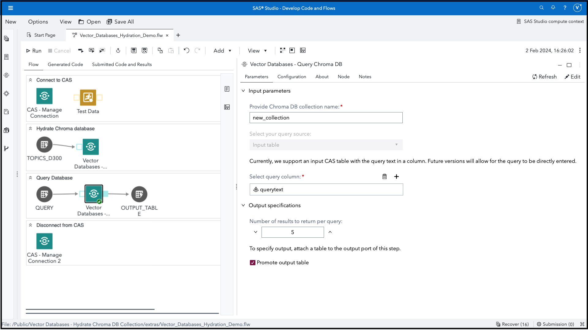

# Vector Databases - Query Chroma DB Collection

This custom step queries a Chroma vector database collection and writes results to a SAS Cloud Analytics Services (CAS) table.

Vector databases facilitate Generative AI and other applications, notably providing context to a Large Language Model (LLM).  Examples of other applications include recommendation engines, similarity search and time series forecasting. 

[Chroma](https://www.trychroma.com/#) is an open-source vector database used in Generative AI pipelines.  It shares similar constructs and concepts with other vector store offerings. 

## User Interface

Here's a quick idea:

 

----
## Table of Contents
1. [Assumptions](#assumptions)
2. [Requirements](#requirements)
3. [Parameters](#parameters)
   1. [Input Parameters](#input-parameters)
   2. [Configuration](#configuration)
   3. [Output Specifications](#output-specifications)
4. [Run-time Control](#run-time-control)
5. [Documentation](#documentation)
6. [SAS Program](#sas-program)
7. [Installation and Usage](#installation--usage)
8. [Created/Contact](#createdcontact)
9. [Change Log](#change-log)
----
## Assumptions

1.  Chroma DB follows client / server architecture.  This step implicitly considers the client and server to be on the same machine (see comments in code).  Users are free to modify the step for persistent, remote/external, or alternatively orchestrated (e.g. Docker container) servers based on their requirement.  Chroma DB documentation provides some examples (refer [Documentation](#documentation)).

2. Embeddings are assumed to be created with [SAS Visual Text Analytics](https://support.sas.com/en/software/visual-text-analytics-support.html) (VTA) for this version of the step.  This step requires a SAS Visual Text Analytics (VTA) license.    

3.  This custom step runs on data loaded to a SAS Cloud Analytics Services (CAS) library (known as a caslib). Ensure you are connected to CAS before running this step.  Also, ensure that your output caslib destination is writeable.

4.  [Proc Python](https://communities.sas.com/t5/SAS-Communities-Library/Using-PROC-PYTHON-to-augment-your-SAS-programs/ta-p/812397) is required.  Required Python packages are listed in prerequisites section.  Also, consider build and install of  Python and required packages through the SAS Configurator for Open Source.

5.  This custom step provides embeddings to Chroma at the time of query and does not use Chroma's embedding function.  Embedding function support will be considered in future. 

-----

## Requirements

1. A SAS Viya 4 environment version 2023.12 or later.

2. Python packages to be installed:

   1. [chromadb](https://pypi.org/project/chromadb/)
   2. [pysqlite-binary](https://pypi.org/project/pysqlite-binary/)
   3. [pandas](https://pypi.org/project/pandas/)
   4. [swat](https://pypi.org/project/swat/)

3. Suggested Python version is [3.10.x](https://www.python.org/downloads/release/python-3100/) due to dependency on [sqlite version >= 3.35.0](https://docs.trychroma.com/troubleshooting#sqlite) (refer documentation).  However, a workaround suggested by Chroma has been followed in the code.

4. Optional components, based on site-specific architecture, are to have a separate Chroma DB server for persistence and scale.  Refer [Chroma documentation](https://docs.trychroma.com/usage-guide) for details.

----
## Parameters
----
### Input Parameters

1. Name of Chroma DB collection (text field, required): provide the name of the Chroma DB collection you might have populated earlier.  You can't query a collection if you don't know the name for the same.

2. Query source (drop-down list, frozen): currently set at "Input table" for this version.  Other options will be examined in future releases.

3  Input table containing a text column (input port, required): attach a CAS table to this port. 

4. Query column (column selector, required, maximum 1): select a text column which contains the query you wish to pass to the database.

----
### Configuration 

1. Embedding model caslib (text field, required):  provide the caslib containing a VTA embedding model which will be applied to the query in order to generate embeddings.

2. Embedding model astore name (text field, required): provide the name of a VTA astore model to generate embeddings on the query text. 

------------------------------------------------------------------
> Follow this process to obtain the above values:

>   1. In Model Studio, right click on the topics node you used to create an embeddings model.  Select Results
>   2. In the score code portion of the results, locate and copy the values of the following macro variables: input_astore_caslib_name & input_astore_name.  Use in the above two fields.
>   3. Some users may choose to develop embedding models programmatically.  They would have specified an astore name and caslib while doing so, which can be used for above fields.
------------------------------------------------------------------

3. Embedding pattern (text column, required, default of _Col):  document embeddings tend to be long series involving 100s or sometimes 1000s of columns.  Provide a text pattern which applies to all embedding column names. For example,  _Col represents _Col_1, _Col_2..... _Col_n.  A default of _Col is provided since this happens to be the default value for Visual Text Analytics-generated embeddings.

4. Location for Chroma database (folder selector, required): select a location where the Chroma database is persisted.  Note this needs to be on the filesystem (SAS Server) and not SAS Content.  

5. CAS server (text field, default entered): change this only if you need a CAS server name different from a typical Viya 4 installation.

6. CAS port (numeric field, default entered): change this only if you know that the CAS server runs on a different port than the default.

----
### Output Specifications

1. Number of results (numeric stepper): provide the number of results you wish to have returned for each observation of the query column. 

2. Output table (output port, required): attach a CAS table to the output port of this node to hold results.

3. Promote (check box): check this box if you wish to have the output table promoted to global scope (and be available beyond the SAS Studio session)

Upon successful completion, the output table will contain the query, the id of the result documents, distance measure and the document content.

----
## Run-time Control

Note: Run-time control is optional.  You may choose whether to execute the main code of this step or not, based on upstream conditions set by earlier SAS programs.  This includes nodes run prior to this custom step earlier in a SAS Studio Flow, or a previous program in the same session.

Refer this blog (https://communities.sas.com/t5/SAS-Communities-Library/Switch-on-switch-off-run-time-control-of-SAS-Studio-Custom-Steps/ta-p/885526) for more details on the concept.

The following macro variable,
```sas
_qcd_run_trigger
```

will initialize with a value of 1 by default, indicating an "enabled" status and allowing the custom step to run.

If you wish to control execution of this custom step, include code in an upstream SAS program to set this variable to 0.  This "disables" execution of the custom step.

To "disable" this step, run the following code upstream:

```sas
%global _qcd_run_trigger;
%let _qcd_run_trigger =0;
```

To "enable" this step again, run the following (it's assumed that this has already been set as a global variable):

```sas
%let _qcd_run_trigger =1;
```


IMPORTANT: Be aware that disabling this step means that none of its main execution code will run, and any  downstream code which was dependent on this code may fail.  Change this setting only if it aligns with the objective of your SAS Studio program.

----
## Documentation

1. Documentation for the [chromadb Python package and Chroma DB](https://docs.trychroma.com)

2. An [important note regarding sqlite](https://docs.trychroma.com/troubleshooting#sqlite)

3. SAS Communities article on configuring [Viya for Python integration](https://communities.sas.com/t5/SAS-Communities-Library/Configuring-SAS-Viya-for-Python-Integration/ta-p/847459)

4. The [SAS Viya Platform Deployment Guide (refer to SAS Configurator for Open Source within)](https://go.documentation.sas.com/doc/en/itopscdc/default/itopssr/p1n66p7u2cm8fjn13yeggzbxcqqg.htm?fromDefault=#p19cpvrrjw3lurn135ih46tjm7oi) 

5.  Options for [persistent clients and client connections in Chroma](https://docs.trychroma.com/usage-guide)

6. Documentation for the [Analytic Store Scoring action set](https://go.documentation.sas.com/doc/en/pgmsascdc/default/casactml/casactml_astore_toc.htm) 

7. [Details on the optional run-time trigger control](https://communities.sas.com/t5/SAS-Communities-Library/Switch-on-switch-off-run-time-control-of-SAS-Studio-Custom-Steps/ta-p/885526)

8. [SAS Communities article](https://communities.sas.com/t5/SAS-Communities-Library/Hotwire-your-SWAT-inside-SAS-Studio/ta-p/835956) on connecting to CAS using the SWAT package in SAS Studio

----
## SAS Program

Refer [here](./extras/Vector_Databases_Query_Chroma_DB_Collection.sas) for the SAS program used by the step.  You'd find this useful for situations where you wish to execute this step through non-SAS Studio Custom Step interfaces such as the [SAS Extension for Visual Studio Code](https://github.com/sassoftware/vscode-sas-extension), with minor modifications. 

----
## Installation & Usage

- Refer to the [steps listed here](https://github.com/sassoftware/sas-studio-custom-steps#getting-started---making-a-custom-step-from-this-repository-available-in-sas-studio).

----
## Created/contact: 

- Sundaresh Sankaran (sundaresh.sankaran@sas.com)
----
## Change Log

* Version 1.0 (30JAN2024) 
    * Initial version