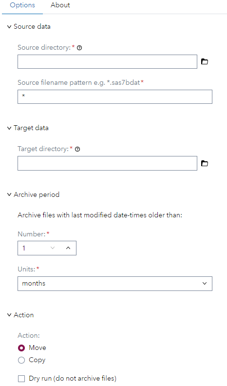
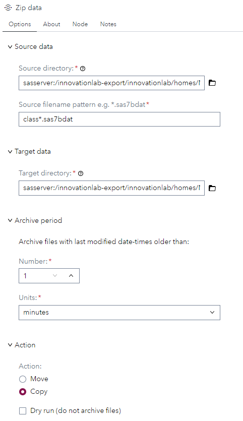
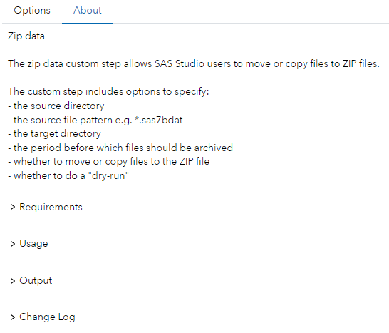

# Zip data

## Description

The zip data custom step allows SAS Studio users to move or copy data to ZIP files.

The custom step includes options to specify:
- the source directory
- the source file pattern e.g. *.sas7bdat
- the target directory
- the period before which files should be archived
- whether to move or copy files to the ZIP file
- whether to do a "dry-run"

## User Interface

### Options tab

   | Standalone mode | Flow mode |
   | --- | --- |                  
   |  |  |

### About tab

   | Standalone & flow mode |
   | --- |                  
   |  |

## Requirements

Tested on SAS Viya Stable 2024.05, with Python 3.9.16 and dateutil 2.9.0.post0.

Python must be [configured](https://go.documentation.sas.com/doc/en/pgmsascdc/default/proc/p1m1pc8yl1crtkn165q2d4njnip1.htm) on the SAS Viya platform.

## Usage

### Demo

This short demo shows how to move two SAS datasets that match the filename pattern class*.sas7bdat to corresponding ZIP files named class*.sas7bdat.zip.

### Custom step options

| Section | Field | Default | Description |
|-|-|-|-|
| Source data | | | |
| | Source directory | None | Source directory on the file system. Directories in SAS Content are not supported |
| | Source filename pattern | * | Filename pattern used to match files in the source directory e.g. *.sas7bdat. See the [glob module](https://docs.python.org/3/library/glob.html) for details |
| Target data | | | |
| | Target directory | None | Archive directory on the file system. Directories in SAS Content are not supported |
| Archive period | | | Archive files with a last modified date-time before a given period. The period is specified as a number and a unit e.g. 1 month. The cutoff is calculated with [dateutil.relativedelta](https://dateutil.readthedocs.io/en/stable/relativedelta.html) |
| | Number | 1 | Number of periods |
| | Units | months | Period unit. Select from minutes, hours, days, weeks, months, years |
| Action | | | |
| | Action | Move | Move or copy files to a ZIP file |
| | Dry run | False | If True, the step will run but not execute the archive step |

### Output

For each file in the source directory that matches the file name pattern and modified date-time constraints, a ZIP file will be created in the archive directory.

For example, if the following source files match:
| Source | Archive |
| - | - |
| [source dir]/class.sas7bdat | [target dir]/class.sas7bdat.zip |
| [source dir]/classfit.sas7bdat | [target dir]/classfit.sas7bdat.zip |

## Change Log

* Version: 1.0 (25JUN2024)
   * Initial version

* Created/contact: 
   * Neil Griffin (neil.griffin@sas.com)
