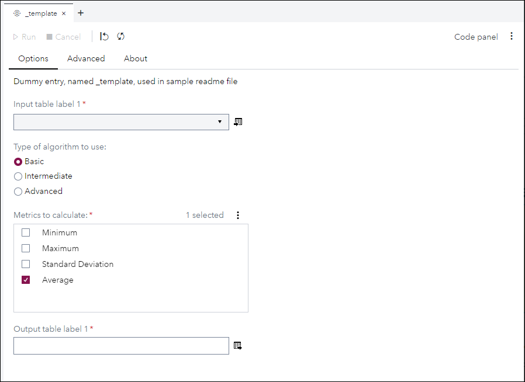
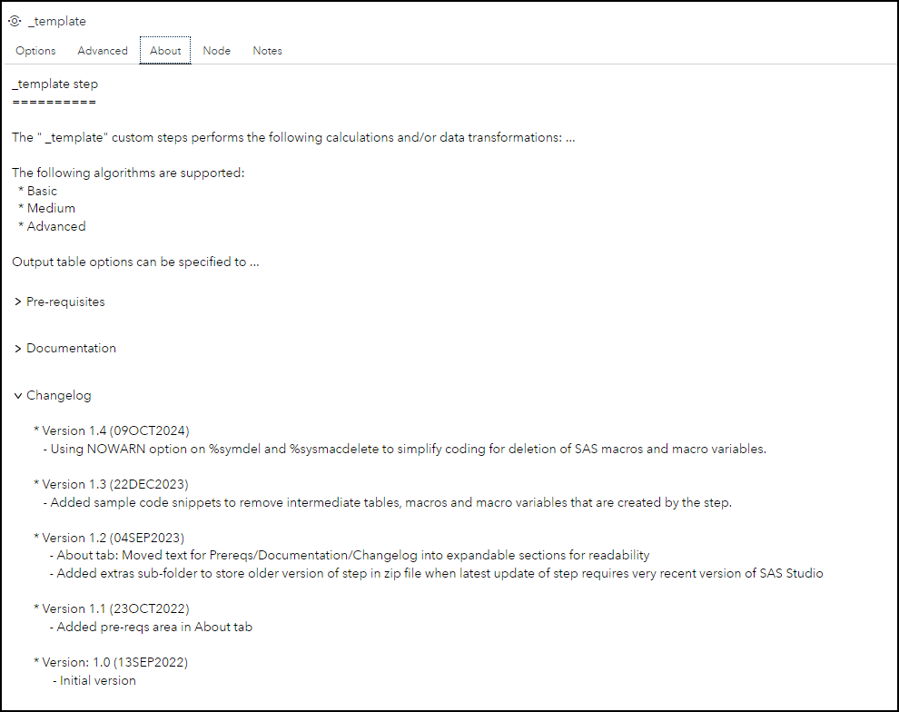

# _template

## Description

>Explain here what capabilities are provided by your custom step - ***Remove this line***

The **_template** custom step enables SAS Studio users to ...

## User Interface

>Create a screenshot for each of the tabs shown in your Custom Step UI, preferably with a 1-pixel black border, and put them in the **img** folder and show them below.  - ***Remove this line***

>Consider adding a screenshot when using your custom step in standalone-mode and one in flow-mode for each tab that contains input table and output table controls, as these controls are hidden when used in flow mode.  - ***Remove this line***

* ### Options tab ###

   | Standalone mode | Flow mode |
   | --- | --- |                  
   |  |  |

* ### Advanced tab ###

   

* ### About tab ###

   

## Requirements

Tested on Viya version Stable 2022.09
> Does your custom step use specific UI controls that have only been released recently, and therefore perhaps require a more recent Viya version? - ***Remove this line***

> Does you custom step require specific products to be installed, or has other dependencies the user should know about, then mention them here. - ***Remove this line*** 

> If your step does not have any specific Viya version pre-reqs then simply state "No specific Viya version requirements" - *** Remove this line ***

> Note: This information should also be provided in the About box of your custom step UI. -  *** Remove this line ***

## Usage

> Optional: Create an animated gif that quickly demos your custom step and its results using a dedicated flow and store it in the **img** folder
 - ***Remove this line*** 

> Recommended approach is to use data that is available in sashelp or sampsio. See [What sample data is available for use in SAS Studio in a SAS Viya deployment?](../docs/FAQ.md#what-sample-data-is-available-for-use-in-sas-studio-in-a-sas-viya-deployment) for more details. - ***Remove this line***

> If there is no suitable data in those locations, then consider adding SAS code in your readme file to create data. One approach is to embed the data inside the data step code itself [example that has data in CSV format inside data step (GeoDistance with Rounding)](../GeoDistance%20with%20Rounding/README.md#usage), another approach could be to generate random data [example of generating random data using a data step (Dynamic Aggregations from Time Series)](Dynamic%20Aggregations%20From%20Timeseries%20DAFT/README.md#usage). The user can then copy that SAS code into a SAS Program tab in SAS Studio and run it to make the dataset available in the SAS Studio session.  - ***Remove this line***

## Change Log

* Version 1.3 (22DEC2023) 
    * Added sample code snippets to remove intermediate tables, macros and macro variables that are created by the step
* Version 1.2 (04SEP2023) 
    * About tab: Moved text for Prereqs/Documentation/Changelog into expandable sections for readability
    * Added **extras** sub-folder to store older version of step in zip file when latest update of step requires very recent version of SAS Studio
* Version 1.1 (23OCT2022) 
    * Added pre-reqs area in About tab
* Version 1.0 (13SEP2022) 
    * Initial version

> Note: Please list versions in descending date order, so the most recent version at the top of the change log.  - ***Remove this line***
