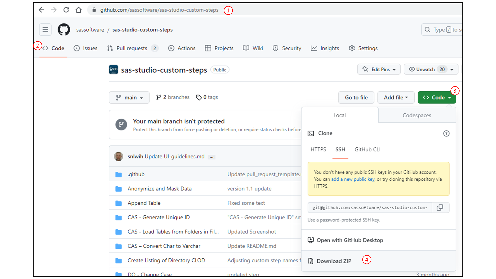
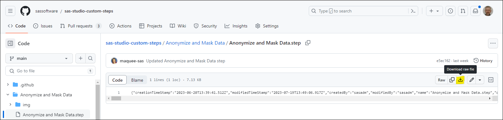

# Using Custom Step from this GitHub repository in SAS Studio

1. Download the **.step** file(s) you want to use from this GitHub repository to your local machine.
    * The complete repository can be downloaded as a ZIP file from the [main repository page](https://github.com/sassoftware/sas-studio-custom-steps) as follows:
        * Click the **Code** button on that main page and select the **Download ZIP** option 
        * Once the ZIP file has been downloaded, extract the **.step** files(s) of interest from the .zip file (Hint: Most zip utilities have an option to sort the contents by file extension, so you see all those files next to each other and can easily select the ones you're interested in)
     * A single file **.step** file can be downloaded as follows:
        *  Select the **.step** file in the your web browser
        *  Click on  the **Download raw file** button to show the content of the **.step** file 
        *  The **.step** file will now be downloaded to a directory on your local machine. The location of that file might depend on your browser.
3. In the **SAS Studio Explorer** pane, highlight the folder in **SAS Content** you want to import the **.step** file(s) to, right-click on the folder and select ***Upload files***.
4. Add the downloaded **.step** file(s) to the **Upload Files** dialog and click ***Upload***.
    * Note: Drag-and-drop is supported. So for, example when using Google Chrome, you can drag-and-drop the downloaded file that is shown at the bottom of your browser, directly into the SAS Studio Upload Files dialog.
5. The step is now visible in the Steps panel, see tab: Shared, and ready for use. You can now run it in standalone mode, add it as a node in a flow, or modify the definition of the step itself. 
