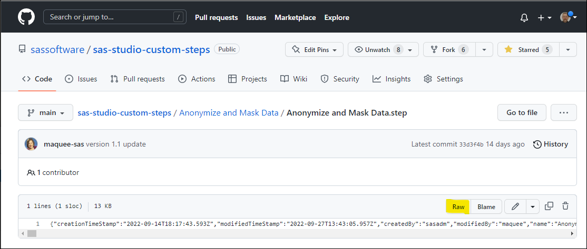
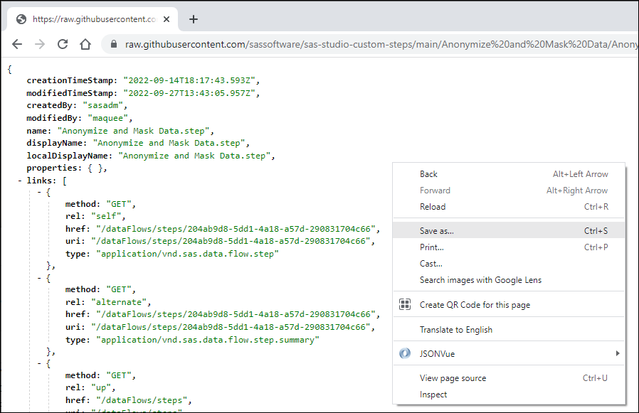
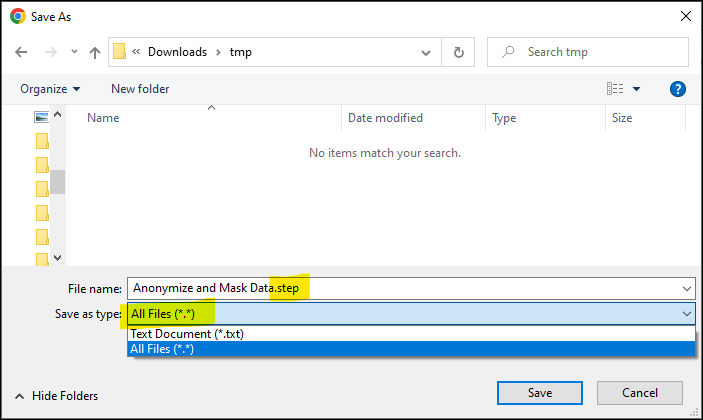

# Using Custom Step from this GitHub repository in SAS Studio

1. Download the **.step** file(s) you want to use from this GitHub repository to your local machine.
    * The complete repository can be downloaded as a ZIP file from the [main repository page](https://github.com/sassoftware/sas-studio-custom-steps) using the **Code** button on that page, and then extract the **.step** files(s) of interest from the .zip file 
     * A single file **.step** file can be downloaded as follows:
        *  Select the **.step** file in the your web browser
        *  Click on  the **Raw** button to show the content of the **.step** file 
        *  Use your right mouse button to show the popup menu and select **Save As** 
        *  In the Save As dialog window specify **Save as type:** **All Files (\*.\*)** and make sure that the file extension is **.step** 
3. In the **SAS Studio Explorer** pane, highlight the folder in **SAS Content** you want to import the **.step** file(s) to, right-click on the folder and select ***Upload files***.
4. Add the downloaded **.step** file(s) to the **Upload Files** dialog and click ***Upload***.
5. The step is now visible in the Steps panel. see tab: Shared, and ready for use. You can now run it in standalone mode, add it as a node in a flow, or modify the definition of the step itself. 

