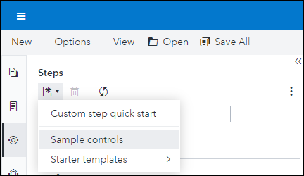
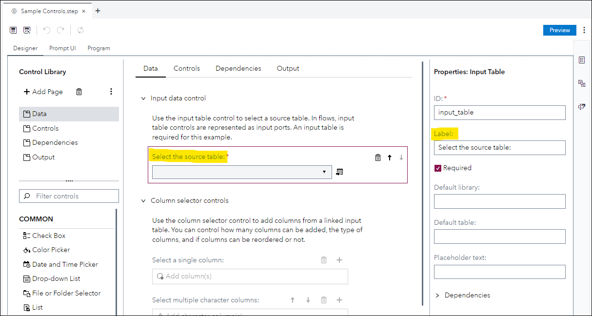

# UI Guidelines

All SAS Studio provided steps follow certain UI guidelines. To provide consistency across steps, including custom steps, it is highly recommended 
that custom step contributions follow these guidelines.

A good example of a custom step that follows these guidelines is the **Sample controls** custom step. You can view it in the Custom Step Designer by going to the **Steps** panel, clicking the 
**New and sample custom steps** button in that panel, and selecting  **Sample controls**.

This opens the Custom Step Designer

| UI Element | Capitalization | Remarks|
| --- | --- | --- |
| Tab labels | Title | Keep them short, preferably one or two words |
| Field labels - includes the labels for any of the UI elements | Sentence | Put colons after labels. For example:  ***Select a column:*** |
| Values in lists   * Drop-down List   * List   * Radio Button Group | Sentence |

  * Title capitalization:
     * Each word starts with capital. Prepositions (such as of, for, with), articles (a, an, the) and conjunctions (and, or, but) should not be initial-capped
  * Sentence capitalization:
     * Only first word is capitalized
